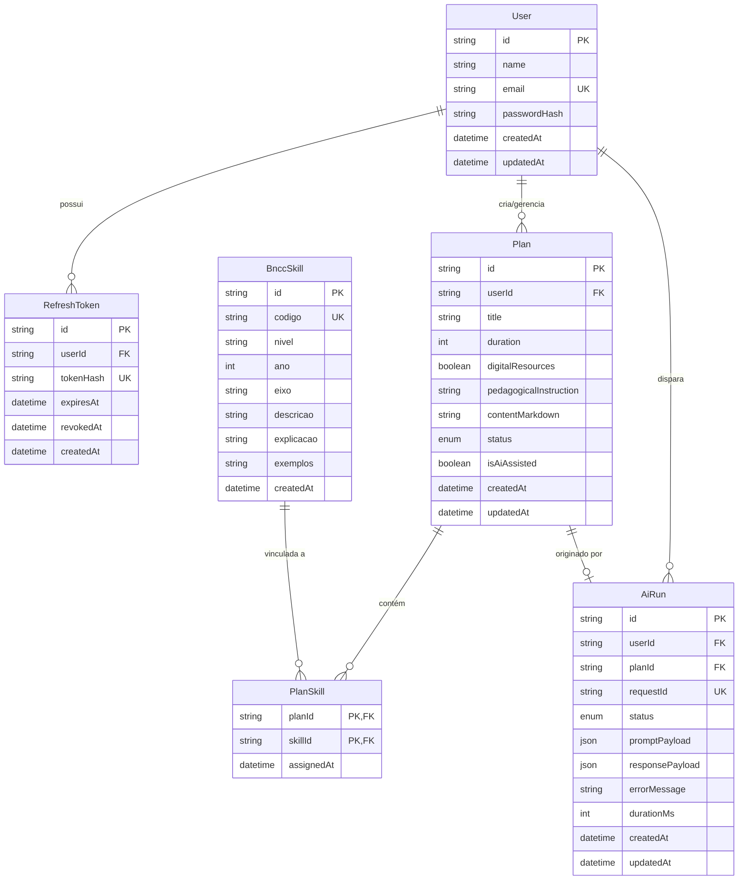

# Data Model Specification: Planejador BNCC

**Feature**: `001-planejador-aulas-bncc`
**Status**: Completed

Este documento define o modelo de dados relacional, entidades, restrições, integridade referencial e estratégia de semente para o banco de dados PostgreSQL utilizando Prisma ORM.

---

## 1. Diagrama Entidade-Relacionamento (ERD)



---

## 2. Definição das Entidades e Atributos

### 2.1. `User` (Docente)
Representa o professor cadastrado e autenticado.
- `id` (`String`, `@id`, `@default(cuid())`): Identificador único do usuário.
- `name` (`String`): Nome completo de exibição (ex.: `"Profª Ana Souza"`).
- `email` (`String`, `@unique`): E-mail único de acesso (ex.: `"ana@demo.bncc.br"`).
- `passwordHash` (`String`): Hash seguro da senha de acesso gerado via bcrypt/argon2.
- `createdAt` (`DateTime`, `@default(now())`): Data e hora de criação da conta.
- `updatedAt` (`DateTime`, `@updatedAt`): Data e hora da última modificação.

### 2.2. `RefreshToken` (Sessão Criptografada)
Armazena o hash dos tokens de renovação para sessões ativas do docente.
- `id` (`String`, `@id`, `@default(cuid())`): Identificador único da sessão.
- `userId` (`String`, `@relation`): Chave estrangeira referenciando `User.id` (com `onDelete: Cascade`).
- `tokenHash` (`String`, `@unique`): Hash criptográfico do refresh token emitido no cookie.
- `expiresAt` (`DateTime`): Timestamp de expiração do token (8 horas após a emissão).
- `revokedAt` (`DateTime?`): Timestamp de revogação explícita (no logout ou rotação).
- `createdAt` (`DateTime`, `@default(now())`): Data de emissão.

### 2.3. `BnccSkill` (Catálogo Curricular Normativo)
Armazena as habilidades oficiais da BNCC.
- `id` (`String`, `@id`, `@default(cuid())`): Identificador interno.
- `codigo` (`String`, `@unique`): Código oficial alfanumérico normativo (ex.: `"EF01CO01"`).
- `nivel` (`String`): Nível de ensino (ex.: `"Ensino Fundamental"`).
- `ano` (`Int?`): Ano escolar quando aplicável (ex.: `1`, `2`, `5`).
- `eixo` (`String`): Componente curricular ou eixo temático (ex.: `"Pensamento Computacional (PC)"`).
- `descricao` (`String`, `@db.Text`): Texto oficial da habilidade curricular.
- `explicacao` (`String`, `@db.Text`): Detalhamento pedagógico oficial da habilidade.
- `exemplos` (`String`, `@db.Text`): Orientações práticas e links de materiais complementares.
- `createdAt` (`DateTime`, `@default(now())`): Data de importação.

### 2.4. `Plan` (Plano de Aula / Rascunho)
Armazena o plano de aula pertencente a um docente.
- `id` (`String`, `@id`, `@default(cuid())`): Identificador único do plano.
- `userId` (`String`, `@relation`): Chave estrangeira referenciando `User.id` (com `onDelete: Cascade`).
- `title` (`String`): Título descritivo do plano de aula (ex.: `"Água e vida no território"`).
- `duration` (`Int`): Duração estimada em minutos (15 a 360).
- `digitalResources` (`Boolean`): Indicador de uso de recursos digitais (`true`/`false`).
- `pedagogicalInstruction` (`String`, `@db.Text`): Intenção e diretrizes informadas pelo professor (10 a 1.000 caracteres).
- `contentMarkdown` (`String`, `@db.Text`): Conteúdo integral em Markdown gerado pela IA e editado pelo professor.
- `status` (`PlanStatus`, `@default(RASCUNHO)`): Enum do ciclo de vida (`RASCUNHO`).
- `isAiAssisted` (`Boolean`, `@default(true)`): Indicador de auxílio por IA para renderização de badge.
- `createdAt` (`DateTime`, `@default(now())`): Data de criação.
- `updatedAt` (`DateTime`, `@updatedAt`): Data da última alteração.

### 2.5. `PlanSkill` (Relacionamento N:N Plano ↔ Habilidades)
Tabela associativa entre planos e habilidades da BNCC vinculadas.
- `planId` (`String`): Chave estrangeira para `Plan.id`.
- `skillId` (`String`): Chave estrangeira para `BnccSkill.id`.
- `assignedAt` (`DateTime`, `@default(now())`): Timestamp da vinculação.
- Chave Primária Composta: `@@id([planId, skillId])`.

### 2.6. `AiRun` (Rastreabilidade e Atomicidade da Geração)
Registra o ciclo de vida e a auditoria de cada requisição ao serviço n8n.
- `id` (`String`, `@id`, `@default(cuid())`): Identificador único da execução de IA.
- `userId` (`String`, `@relation`): Professor solicitante.
- `planId` (`String?`, `@unique`): Plano gerado associado (nulo enquanto pendente ou em falha).
- `requestId` (`String`, `@unique`): Identificador único UUID para correlação de logs.
- `status` (`AiRunStatus`, `@default(PENDING)`): Enum de estado (`PENDING`, `SUCCEEDED`, `FAILED`).
- `promptPayload` (`Json`): Cópia exata do payload JSON transmitido ao n8n.
- `responsePayload` (`Json?`): Payload bruto retornado pelo n8n em caso de sucesso.
- `errorMessage` (`String?`, `@db.Text`): Mensagem de erro amigável em caso de falha.
- `durationMs` (`Int?`): Tempo decorrido em milissegundos para fins de observabilidade.
- `createdAt` (`DateTime`, `@default(now())`): Timestamp de início.
- `updatedAt` (`DateTime`, `@updatedAt`): Timestamp de finalização.

---

## 3. Esquema Prisma Completo (`schema.prisma`)

```prisma
datasource db {
  provider = "postgresql"
  url      = env("DATABASE_URL")
}

generator client {
  provider = "prisma-client-js"
}

enum PlanStatus {
  RASCUNHO
}

enum AiRunStatus {
  PENDING
  SUCCEEDED
  FAILED
}

model User {
  id            String         @id @default(cuid())
  name          String
  email         String         @unique
  passwordHash  String
  createdAt     DateTime       @default(now())
  updatedAt     DateTime       @updatedAt

  plans         Plan[]
  refreshTokens RefreshToken[]
  aiRuns        AiRun[]

  @@map("users")
}

model RefreshToken {
  id        String    @id @default(cuid())
  userId    String
  tokenHash String    @unique
  expiresAt DateTime
  revokedAt DateTime?
  createdAt DateTime  @default(now())

  user      User      @relation(fields: [userId], references: [id], onDelete: Cascade)

  @@index([userId])
  @@map("refresh_tokens")
}

model BnccSkill {
  id          String      @id @default(cuid())
  codigo      String      @unique
  nivel       String
  ano         Int?
  eixo        String
  descricao   String      @db.Text
  explicacao  String      @db.Text
  exemplos    String      @db.Text
  createdAt   DateTime    @default(now())

  planSkills  PlanSkill[]

  @@index([nivel, ano])
  @@index([eixo])
  @@map("bncc_skills")
}

model Plan {
  id                     String      @id @default(cuid())
  userId                 String
  title                  String
  duration               Int
  digitalResources       Boolean     @default(false)
  pedagogicalInstruction String      @db.Text
  contentMarkdown        String      @db.Text
  status                 PlanStatus  @default(RASCUNHO)
  isAiAssisted           Boolean     @default(true)
  createdAt              DateTime    @default(now())
  updatedAt              DateTime    @updatedAt

  user                   User        @relation(fields: [userId], references: [id], onDelete: Cascade)
  planSkills             PlanSkill[]
  aiRun                  AiRun?

  @@index([userId, updatedAt])
  @@map("plans")
}

model PlanSkill {
  planId     String
  skillId    String
  assignedAt DateTime  @default(now())

  plan       Plan      @relation(fields: [planId], references: [id], onDelete: Cascade)
  skill      BnccSkill @relation(fields: [skillId], references: [id], onDelete: Cascade)

  @@id([planId, skillId])
  @@index([skillId])
  @@map("plan_skills")
}

model AiRun {
  id              String      @id @default(cuid())
  userId          String
  planId          String?     @unique
  requestId       String      @unique
  status          AiRunStatus @default(PENDING)
  promptPayload   Json
  responsePayload Json?
  errorMessage    String?     @db.Text
  durationMs      Int?
  createdAt       DateTime    @default(now())
  updatedAt       DateTime    @updatedAt

  user            User        @relation(fields: [userId], references: [id], onDelete: Cascade)
  plan            Plan?       @relation(fields: [planId], references: [id], onDelete: SetNull)

  @@index([userId])
  @@index([requestId])
  @@map("ai_runs")
}
```

---

## 4. Estratégia de Semente de Dados (`prisma/seed.ts`)

A execução do seed é **100% idempotente** utilizando operações `upsert` com base em chaves únicas:

1. **Catálogo de Habilidades da BNCC (`docs/data/bncc-recorte.json`):**
   - O arquivo JSON com as 5 habilidades oficiais da BNCC Computação (`EF01CO01`, `EF01CO02`, `EF02CO02`, `EF02CO04`, `EF02CO06`) é lido pelo script.
   - Cada habilidade é inserida ou atualizada através de `prisma.bnccSkill.upsert({ where: { codigo } })`.
2. **Contas de Demonstração Locais:**
   - **Conta 1 (Profª Ana Souza):**
     - E-mail: `ana@demo.bncc.br`
     - Senha padrão de demo: `demo123` (armazenada como hash bcrypt).
     - Rascunhos iniciais: 4 planos criados (ex.: `"Água e vida no território"`, `"Leitura de paisagens brasileiras"`, etc., correspondendo fielmente ao frame `2:11830`).
   - **Conta 2 (Prof. Marcos Lima):**
     - E-mail: `marcos@demo.bncc.br`
     - Senha padrão de demo: `demo123` (armazenada como hash bcrypt).
     - Rascunhos iniciais: nenhum (estado vazio inicial, permitindo testar instantaneamente a tela `2:11932` e comprovar o isolamento total contra os planos da Professora Ana).
