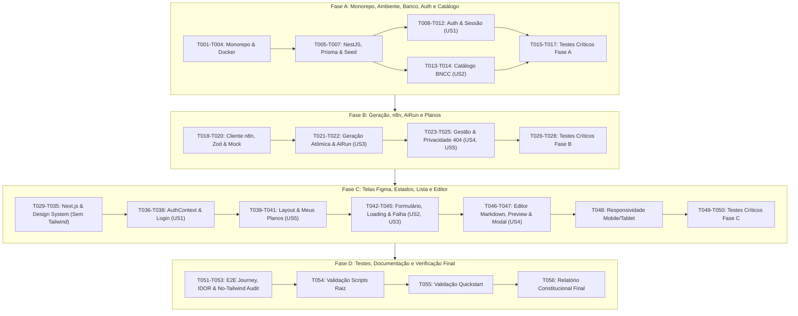

# Tasks: Planejador BNCC

**Feature**: `001-planejador-aulas-bncc`  
**Branch**: `docs/planejamento`  
**Input Documents**: 
- `specs/001-planejador-aulas-bncc/spec.md`
- `specs/001-planejador-aulas-bncc/plan.md`
- `specs/001-planejador-aulas-bncc/data-model.md`
- `specs/001-planejador-aulas-bncc/contracts/` (`auth`, `bncc`, `plans`, `n8n`)
- `specs/001-planejador-aulas-bncc/quickstart.md`
- `.specify/memory/constitution.md`

Este documento decompõe o plano de implementação em tarefas acionáveis e ordenadas por dependência, estruturadas nas quatro fases solicitadas:
- **Fase A**: Monorepo, scripts, ambiente, banco, Prisma, autenticação e catálogo;
- **Fase B**: Geração, cliente n8n, validação, AiRun e privacidade de planos;
- **Fase C**: Telas Figma, estados, lista e editor;
- **Fase D**: Testes, documentação e verificação final.

---

## Fase A: Monorepo, Scripts, Ambiente, Banco, Prisma, Autenticação e Catálogo

**Objetivo da Fase**: Estabelecer a infraestrutura do monorepo pnpm, banco PostgreSQL no Docker, esquema e migrações do Prisma com seed idempotente, fronteira de segurança no NestJS (`apps/api`) com autenticação por cookies `HttpOnly` e o catálogo de habilidades da BNCC com busca indexada.

**Critérios de Conclusão da Fase A**:
- Monorepo pnpm configurado com scripts raiz funcionais (`dev`, `lint`, `typecheck`, `test`, `test:integration`, `build`).
- PostgreSQL 16 rodando via Docker Compose e migrações do Prisma aplicadas com integridade relacional.
- Seed idempotente executado com sucesso, carregando `docs/data/bncc-recorte.json` e as contas `ana@demo.bncc.br` e `marcos@demo.bncc.br`.
- Endpoints de autenticação (`/api/auth/login`, `/api/auth/refresh`, `/api/auth/logout`, `/api/auth/me`) emitindo e rotacionando tokens com hash SHA-256 no banco e cookie `HttpOnly; SameSite=Strict; Path=/api/auth`.
- Endpoint `GET /api/bncc/skills` respondendo consultas com filtros de nível, ano, eixo e texto em menos de 200ms.
- Todos os testes unitários e de integração da Fase A passando.

### Tarefas da Fase A

#### Monorepo, Ambiente e Scripts Raiz
- [ ] T001 Configurar workspace do monorepo e scripts raiz (`dev`, `lint`, `typecheck`, `test`, `test:integration`, `build`) em `pnpm-workspace.yaml` e `package.json`
- [ ] T002 [P] Configurar regras e aliases compartilhados de TypeScript em `tsconfig.base.json`
- [ ] T003 [P] Configurar serviço de banco de dados PostgreSQL 16 com volume persistente em `docker-compose.yml`
- [ ] T004 [P] Criar templates de variáveis de ambiente com parâmetros locais em `apps/api/.env.example` e `apps/web/.env.example`

#### Banco de Dados, Prisma e Seed Idempotente
- [ ] T005 Inicializar aplicação NestJS 11 com TypeScript e dependências de segurança em `apps/api/package.json` e `apps/api/tsconfig.json`
- [ ] T006 Definir esquema relacional completo do Prisma com modelos `User`, `RefreshToken`, `BnccSkill`, `Plan`, `PlanSkill`, `AiRun` e enums `PlanStatus` (`RASCUNHO`) e `AiRunStatus` (`PENDING`, `SUCCEEDED`, `FAILED`) em `apps/api/prisma/schema.prisma`
- [ ] T007 Implementar script de seed idempotente (`upsert`) populando o catálogo BNCC a partir de `docs/data/bncc-recorte.json` e as contas demo `ana@demo.bncc.br` (com 4 planos) e `marcos@demo.bncc.br` (com 0 planos) em `apps/api/prisma/seed.ts`

#### Autenticação, Sessão e Fronteira de Dados (US1 - Backend)
- [ ] T008 [P] [US1] Implementar serviço de hash e validação de senhas com bcrypt em `apps/api/src/modules/auth/password.service.ts`
- [ ] T009 [P] [US1] Implementar serviço de gestão de Refresh Tokens persistindo apenas hash criptográfico SHA-256 e data de expiração de 8h em `apps/api/src/modules/auth/refresh-token.service.ts`
- [ ] T010 [US1] Implementar estratégia Passport JWT para validação de Access Token em memória e guardas de proteção de rota em `apps/api/src/modules/auth/jwt.strategy.ts` e `apps/api/src/modules/auth/jwt-auth.guard.ts`
- [ ] T011 [US1] Implementar `AuthService` e `AuthController` com endpoints `/api/auth/login`, `/api/auth/refresh`, `/api/auth/logout` e `/api/auth/me`, configurando cookie `HttpOnly; Path=/api/auth; SameSite=Strict; [Secure condicional]` em `apps/api/src/modules/auth/auth.service.ts` e `apps/api/src/modules/auth/auth.controller.ts`
- [ ] T012 Configurar bootstrap do NestJS com prefixo `/api`, CORS restrito a `http://localhost:3000` com `credentials: true`, cookie-parser e validação global de DTOs via `ValidationPipe` em `apps/api/src/main.ts`

#### Catálogo Curricular BNCC (US2 - Backend)
- [ ] T013 [P] [US2] Implementar `BnccService` com consultas otimizadas e filtros compostos por nível, ano escolar, eixo e busca textual por código/descrição em `apps/api/src/modules/bncc/bncc.service.ts`
- [ ] T014 [US2] Implementar `BnccController` expondo `GET /api/bncc/skills` protegido por `JwtAuthGuard` em `apps/api/src/modules/bncc/bncc.controller.ts`

#### Testes Críticos da Fase A
- [ ] T015 [P] [US1] Criar testes unitários para o serviço de autenticação, hashing de senhas e rotação de refresh token em `apps/api/src/modules/auth/auth.service.spec.ts`
- [ ] T016 [P] [US1] Criar testes de integração E2E para o fluxo completo de autenticação (login válido, login com credenciais inválidas retornando 401, rotação de refresh token no cookie e logout) em `apps/api/test/auth.e2e-spec.ts`
- [ ] T017 [P] [US2] Criar testes de integração E2E para consulta ao catálogo BNCC, validando filtros por ano, eixo e busca textual `q` em `apps/api/test/bncc.e2e-spec.ts`

---

## Fase B: Geração, Cliente n8n, Validação, AiRun e Privacidade de Planos

**Objetivo da Fase**: Implementar o cliente HTTP para o workflow n8n conforme o contrato confirmado em `docs/contracts/n8n.md`, a validação estrita de payloads e respostas com Zod, o ciclo atômico de geração de planos com máquina de estados `AiRun` e o isolamento de privacidade de planos com prevenção a IDOR (retornando HTTP 404).

**Critérios de Conclusão da Fase B**:
- Cliente `N8nClient` operacional com header `x-api-key`, header `x-request-id`, timeout estrito de 60s via `AbortController` e sem retry automático.
- Modo mock local funcional ativado por `N8N_MOCK_MODE=true`, com simulação determinística de sucesso e falhas com `[SIMULAR_ERRO]` e `[SIMULAR_TIMEOUT]`.
- Ciclo de geração com transação atômica única no Prisma: sucesso cria `Plan` (`status: RASCUNHO`, `isAiAssisted: true`) e marca `AiRun` (`SUCCEEDED`); falha marca `AiRun` (`FAILED`) e garante **zero planos parciais** inseridos.
- Operações de leitura, atualização e exclusão de planos estritamente isoladas por `userId`: acesso a plano inexistente ou de outro professor responde rigorosamente com **HTTP 404 Not Found**.
- Testes críticos da Fase B aprovados (Zod schema, atomicidade transacional e segurança IDOR 404).

### Tarefas da Fase B

#### Cliente HTTP n8n e Modo Mock Local
- [ ] T018 [P] [US3] Definir esquemas Zod para validação do payload de envio ao n8n e validação estrita da resposta (`success: true`, `sessao: string`, `habilidade: string`, `answer: string`, `format: "markdown"`) em `apps/api/src/modules/n8n/n8n.schema.ts`
- [ ] T019 [US3] Implementar `N8nClient` com cabeçalhos `x-api-key` e `x-request-id`, cancelamento por timeout de 60 segundos via `AbortController` e proibição de retry automático em `apps/api/src/modules/n8n/n8n.client.ts`
- [ ] T020 [P] [US3] Implementar serviço de mock local para n8n ativado via `N8N_MOCK_MODE=true`, fornecendo resposta pedagógica estruturada em Markdown ou simulando falhas sob demanda com as tags `[SIMULAR_ERRO]` e `[SIMULAR_TIMEOUT]` em `apps/api/src/modules/n8n/n8n-mock.service.ts`

#### Ciclo Atômico de Geração e Entidade AiRun (US3 - Backend)
- [ ] T021 [P] [US3] Implementar DTO de geração de planos com validações de `class-validator`: `skillIds` (array com 1 a 5 IDs válidos), `duration` (inteiro entre 15 e 360), `digitalResources` (booleano) e `pedagogicalInstruction` (texto de 10 a 1.000 caracteres) em `apps/api/src/modules/plans/dto/generate-plan.dto.ts`
- [ ] T022 [US3] Implementar serviço de geração atômica de planos gerenciando o ciclo de vida de `AiRun`: registrar `PENDING`, invocar `N8nClient`, executar `prisma.$transaction` em caso de sucesso criando `Plan` (`RASCUNHO`, `isAiAssisted: true`) e atualizando `AiRun` para `SUCCEEDED`; em caso de erro, atualizar `AiRun` para `FAILED` sem persistir nenhum plano parcial em `apps/api/src/modules/plans/plans-generation.service.ts`

#### Gestão, Edição e Privacidade de Planos (US4 & US5 - Backend)
- [ ] T023 [P] [US4] Implementar DTO de atualização de planos com validação de `contentMarkdown` (mínimo de 10 caracteres) e `title` opcional em `apps/api/src/modules/plans/dto/update-plan.dto.ts`
- [ ] T024 [US5] Implementar `PlansService` com isolamento estrito por `userId`: listar rascunhos do docente logado, obter plano por ID, salvar alterações de Markdown e excluir plano, disparando `NotFoundException` (HTTP 404) para planos inexistentes ou pertencentes a outro professor em `apps/api/src/modules/plans/plans.service.ts`
- [ ] T025 [US3, US4, US5] Implementar `PlansController` expondo `GET /api/plans`, `GET /api/plans/:id`, `POST /api/plans/generate`, `PUT /api/plans/:id` e `DELETE /api/plans/:id`, protegidos por `JwtAuthGuard` em `apps/api/src/modules/plans/plans.controller.ts`

#### Testes Críticos da Fase B
- [ ] T026 [P] [US3] Criar testes unitários para o `N8nClient` validando schema Zod, injeção de headers `x-api-key`/`x-request-id`, interrupção por timeout de 60s e modo mock em `apps/api/src/modules/n8n/n8n.client.spec.ts`
- [ ] T027 [P] [US3] Criar testes de integração E2E para o ciclo de geração com IA: validar criação atômica em sucesso e validar que falha com `[SIMULAR_ERRO]` marca `AiRun` como `FAILED` e mantém ZERO planos parciais no banco em `apps/api/test/plans-generation.e2e-spec.ts`
- [ ] T028 [P] [US5] Criar testes de integração E2E de multitenancy e prevenção a IDOR: validar que requisições do Prof. Marcos para planos da Profª Ana retornam estritamente HTTP 404 em `apps/api/test/plans-privacy.e2e-spec.ts`

---

## Fase C: Telas Figma, Estados, Lista e Editor

**Objetivo da Fase**: Construir o frontend Next.js 15 (App Router) sem Tailwind CSS, implementando o Design System do Figma (Frame `2-11440`) com CSS Modules e variáveis nativas, componentes reutilizáveis, fluxo de autenticação, listagem de planos com estado vazio, formulário de planejamento com validações, estados visuais de loading e erro preservando formulário, editor Markdown com pré-visualização sanitizada e modal de confirmação de descarte.

**Critérios de Conclusão da Fase C**:
- Design System estruturado em `tokens.css` com 100% de aderência às cores, tipografia, espaçamentos e raios do Figma, **sem Tailwind CSS**.
- Biblioteca de componentes reutilizáveis acessíveis (`Button`, `Input`, `Textarea`, `Badge`, `Chip`, `Alert`, `Modal`, `Spinner`).
- Login com validação em tempo real e callout de credenciais inválidas (Frame `2-11755`).
- Listagem "Meus planos" exibindo cards de rascunhos (Frame `2-11830`) e estado vazio acolhedor para usuários sem planos (Frame `2-11932`).
- Formulário de novo plano validando 1-5 habilidades, duração 15-360 min, switch e instrução 10-1.000 chars com contador (Frame `2-11990`).
- Tela de loading com animação e barra de progresso (Frame `2-12155`).
- Estado de falha de geração exibindo callout de erro superior, preservando 100% dos dados digitados e botão "Tentar gerar novamente" (Frame `2-12329`).
- Editor de rascunho com alternância entre "Editor Markdown" e "Pré-visualização" sanitizada com `rehype-sanitize` e salvamento explícito (Frame `2-12495`).
- Modal de confirmação "Sair sem salvar?" interceptando navegação com alterações pendentes (Frame `2-12608`).
- Layout responsivo verificado para Mobile (360px+), Tablet (768px+) e Desktop (1024px+).

### Tarefas da Fase C

#### Setup do Frontend e Design System (Frame 2-11440 - Sem Tailwind)
- [ ] T029 Inicializar aplicação Next.js 15 App Router com TypeScript e CSS Modules em `apps/web/package.json` e `apps/web/tsconfig.json`
- [ ] T030 Implementar variáveis globais de Design Tokens nativos extraídos do Figma Frame `2-11440` (cores, tipografia Inter, sombras, border-radius e espaçamentos) em `apps/web/src/styles/tokens.css` e `apps/web/src/styles/globals.css`
- [ ] T031 [P] Implementar componente reutilizável `Button` com variantes (primary, secondary, destructive, ghost, loading) em `apps/web/src/components/ui/Button.tsx` e `apps/web/src/components/ui/Button.module.css`
- [ ] T032 [P] Implementar componentes reutilizáveis `Input` e `Textarea` com suporte a estados (hover, focus, error, valid e contador de caracteres) em `apps/web/src/components/ui/Input.tsx`, `apps/web/src/components/ui/Textarea.tsx` e seus respectivos CSS Modules
- [ ] T033 [P] Implementar componentes reutilizáveis `Badge` e `Chip` (com botão de remoção rápida `x` para habilidades e tags `RASCUNHO` / `Auxílio por IA`) em `apps/web/src/components/ui/Badge.tsx` e `apps/web/src/components/ui/Badge.module.css`
- [ ] T034 [P] Implementar componente reutilizável `Alert` / `Callout` com variantes informativa, sucesso, aviso e erro em `apps/web/src/components/ui/Alert.tsx` e `apps/web/src/components/ui/Alert.module.css`
- [ ] T035 [P] Implementar componente de diálogo acessível `Modal` com foco aprisionado, backdrop e tecla Escape em `apps/web/src/components/ui/Modal.tsx` e `apps/web/src/components/ui/Modal.module.css`

#### Autenticação e Sessão no Cliente Web (US1 - UI, Frame 2-11755)
- [ ] T036 Implementar cliente HTTP de frontend para requisições à API (`http://localhost:3001/api`) com injeção automática de Bearer Token e `credentials: include` em `apps/web/src/lib/api-client.ts`
- [ ] T037 Implementar `AuthContext` e provedor de autenticação com retenção do Access Token curto estritamente em memória, rotação silenciosa de sessão via `/api/auth/refresh` e logout em `apps/web/src/context/AuthContext.tsx`
- [ ] T038 [US1] Implementar tela de Login baseada no Figma Frame `2-11755` com campos de e-mail e senha, validação de formato, estados de loading no botão "Entrar" e exibição do callout de credenciais inválidas em `apps/web/src/app/(auth)/login/page.tsx` e `apps/web/src/app/(auth)/login/login.module.css`

#### Layout Autenticado e Meus Planos (US5 - UI, Frames 2-11830 e 2-11932)
- [ ] T039 Implementar layout autenticado do dashboard com cabeçalho de navegação, logotipo, menu do professor e botão de logout em `apps/web/src/app/(dashboard)/layout.tsx` e `apps/web/src/app/(dashboard)/layout.module.css`
- [ ] T040 [US5] Implementar tela "Meus planos — Rascunhos" baseada no Figma Frame `2-11830` com grid de cards contendo título, badges `RASCUNHO`/`IA`, chips BNCC, duração, data de atualização e ações em `apps/web/src/app/(dashboard)/planos/page.tsx` e `apps/web/src/app/(dashboard)/planos/planos.module.css`
- [ ] T041 [US5] Implementar estado vazio de "Meus planos" baseado no Figma Frame `2-11932` exibindo ilustração temática, texto de orientação acolhedor e botão CTA "Criar novo plano" em `apps/web/src/components/plans/EmptyPlansState.tsx` e `apps/web/src/components/plans/EmptyPlansState.module.css`

#### Formulário de Planejamento e Estados de Geração (US2 & US3 - UI, Frames 2-11990, 2-12155, 2-12329)
- [ ] T042 [US2] Implementar seletor interativo de habilidades BNCC com campo de busca textual rápida, filtros por nível e ano escolar e adição em chips com limite estrito de 1 a 5 seleções em `apps/web/src/components/plans/BnccSkillSelector.tsx` e `apps/web/src/components/plans/BnccSkillSelector.module.css`
- [ ] T043 [US2, US3] Implementar página "Novo plano — Formulário com validações" baseada no Figma Frame `2-11990` com duração (15–360 min), switch de recursos digitais, textarea de instrução (10–1.000 chars) com contador dinâmico e validações visuais em `apps/web/src/app/(dashboard)/novo/page.tsx` e `apps/web/src/app/(dashboard)/novo/novo.module.css`
- [ ] T044 [US3] Implementar estado visual "Novo plano — Preparando rascunho" baseado no Figma Frame `2-12155` com spinner animado, barra de progresso suave, mensagem de status da IA e bloqueio de cliques duplos em `apps/web/src/components/plans/GenerationLoadingState.tsx` e `apps/web/src/components/plans/GenerationLoadingState.module.css`
- [ ] T045 [US3] Implementar estado visual "Novo plano — Falha de geração" baseado no Figma Frame `2-12329` com callout de erro superior, retenção integral dos campos preenchidos e botão transformado em "Tentar gerar novamente" em `apps/web/src/components/plans/GenerationErrorCallout.tsx`

#### Editor Markdown, Pré-visualização Sanitizada e Modal de Saída (US4 - UI, Frames 2-12495 e 2-12608)
- [ ] T046 [US4] Implementar página "Rascunho gerado — Editor e pré-visualização" baseada no Figma Frame `2-12495` com alternância entre "Editor Markdown" e "Pré-visualização" sanitizada com `rehype-sanitize` e `remark-gfm`, badges de status e botão "Salvar alterações" em `apps/web/src/app/(dashboard)/plano/[id]/page.tsx` e `apps/web/src/app/(dashboard)/plano/[id]/plano-editor.module.css`
- [ ] T047 [US4] Implementar modal de confirmação "Rascunho — Confirmação de saída" baseado no Figma Frame `2-12608` interceptando navegações com alterações não salvas com botões "Continuar editando" e "Descartar alterações" em `apps/web/src/components/plans/UnsavedChangesModal.tsx`

#### Adaptações Responsivas e Acessibilidade (Princípio VI)
- [ ] T048 [P] Implementar adaptações de layout responsivo para telas Mobile (360px–767px em coluna única com abas cheias no editor) e Tablet (768px–1023px) em `apps/web/src/styles/responsive.module.css`

#### Testes Críticos da Fase C
- [ ] T049 [P] [US2, US3] Criar testes de componentes para o formulário de novo plano validando limites de seleção de chips (1 a 5), faixas de duração permitidas e contador de caracteres em `apps/web/src/components/plans/NewPlanForm.spec.tsx`
- [ ] T050 [P] [US4] Criar testes unitários para a pré-visualização de Markdown garantindo sanitização e bloqueio de injeção de tags HTML perigosas (`<script>`, `<iframe>`, `onload=`) via `rehype-sanitize` em `apps/web/src/components/plans/MarkdownPreview.spec.tsx`

---

## Fase D: Testes, Documentação e Verificação Final

**Objetivo da Fase**: Realizar a validação cruzada ponta a ponta dos critérios de aceite de todas as 5 histórias de usuário, executar a bateria completa de scripts do monorepo, auditar a ausência de Tailwind CSS, verificar a fidelidade ao guia rápido de inicialização (`quickstart.md`) e validar a conformidade com a Constituição do projeto.

**Critérios de Conclusão da Fase D**:
- Teste E2E de jornada completa simulando o fluxo docente: login -> consulta BNCC -> geração de plano via mock -> edição Markdown -> salvamento explícito -> visualização em "Meus planos".
- Teste automatizado de segurança validando o isolamento de planos com retorno HTTP 404 e redirecionamento de interface diante de IDOR.
- Script de auditoria estática aprovado confirmando **zero ocorrências de classes ou dependências do Tailwind CSS** em `apps/web`.
- Execução bem-sucedida de todos os scripts raiz: `pnpm typecheck`, `pnpm lint`, `pnpm test`, `pnpm test:integration` e `pnpm build`.
- Roteiro do `quickstart.md` validado com comandos reais e contas demo (`ana@demo.bncc.br` e `marcos@demo.bncc.br`).
- Relatório de conformidade constitucional ratificado em `plan.md`.

### Tarefas da Fase D

#### Testes Integrados e Auditoria End-to-End
- [ ] T051 Implementar teste de jornada E2E docente abrangendo login, navegação no catálogo BNCC, submissão de geração com mock n8n, transição de loading, edição de Markdown, pré-visualização e salvamento em `apps/api/test/e2e-journey.spec.ts`
- [ ] T052 [P] Implementar teste de segurança e interface validando resposta HTTP 404 e redirecionamento com alerta ao tentar abrir plano de outro docente em `apps/web/src/app/(dashboard)/plano/plano-security.spec.tsx`
- [ ] T053 [P] Implementar script de auditoria estática para verificar e garantir a ausência absoluta de diretivas ou classes do Tailwind CSS no projeto em `scripts/verify-no-tailwind.js`

#### Verificação dos Scripts Raiz e Quickstart
- [ ] T054 Executar e validar a suíte completa de scripts raiz no terminal: `pnpm typecheck`, `pnpm lint`, `pnpm test`, `pnpm test:integration` e `pnpm build`
- [ ] T055 Executar e validar os procedimentos descritos no `specs/001-planejador-aulas-bncc/quickstart.md` com contêiner Docker do PostgreSQL, migrações e seed idempotente

#### Documentação e Auditoria Constitucional
- [ ] T056 Atualizar o relatório final de implementação e auditoria dos 8 princípios constitucionais em `specs/001-planejador-aulas-bncc/plan.md`

---

## Dependências e Ordem de Execução

---

## Oportunidades de Execução Paralela

| Fase | Tarefas Paralelizáveis com a Marcação `[P]` |
|---|---|
| **Fase A** | `T002` (TypeScript), `T003` (Docker Compose) e `T004` (Env examples).  `T008` (Password service) e `T009` (Refresh token service).  `T013` (BnccService).  `T015`, `T016` e `T017` (Testes críticos de Auth e BNCC). |
| **Fase B** | `T018` (Zod schemas) e `T020` (N8n mock service).  `T021` (GeneratePlan DTO) e `T023` (UpdatePlan DTO).  `T026` (N8n unit tests), `T027` (Atomic generation test) e `T028` (Privacy IDOR 404 test). |
| **Fase C** | `T031` (Button), `T032` (Input/Textarea), `T033` (Badge/Chip), `T034` (Alert) e `T035` (Modal).  `T048` (Responsividade mobile/tablet).  `T049` (Component tests formulário) e `T050` (Markdown sanitization test). |
| **Fase D** | `T052` (IDOR interface test) e `T053` (Auditoria no-tailwind). |

---

## Estratégia de Entrega Incremental e MVP

1. **Incremento 1 (MVP - Conclusão da Fase A + Login):**
   - Infraestrutura e banco de dados funcionais.
   - Login e persistência de sessão segura com cookie `HttpOnly`.
   - Consulta ao catálogo de habilidades da BNCC.
2. **Incremento 2 (Geração Atômica com IA - Conclusão da Fase B):**
   - Integração com webhook n8n com header `x-api-key`, timeout de 60s e modo mock.
   - Ciclo de vida da entidade `AiRun` com transação única e garantia de zero planos parciais.
   - Isolamento de multitenancy com resposta HTTP 404.
3. **Incremento 3 (Experiência Visual Completa - Conclusão da Fase C):**
   - Telas do Figma implementadas com Design Tokens nativos (sem Tailwind).
   - Formulário com chips e validações, loading animado e callout de erro preservando campos.
   - Editor Markdown com pré-visualização sanitizada e modal de confirmação de descarte.
4. **Incremento 4 (Auditoria e Validação - Conclusão da Fase D):**
   - Suíte de testes integrada, verificação dos 5 scripts raiz e validação do `quickstart.md`.
